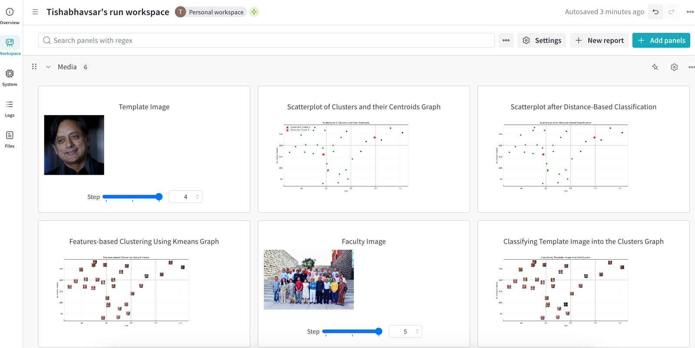
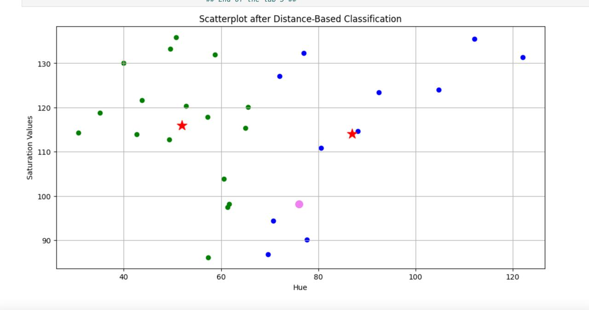
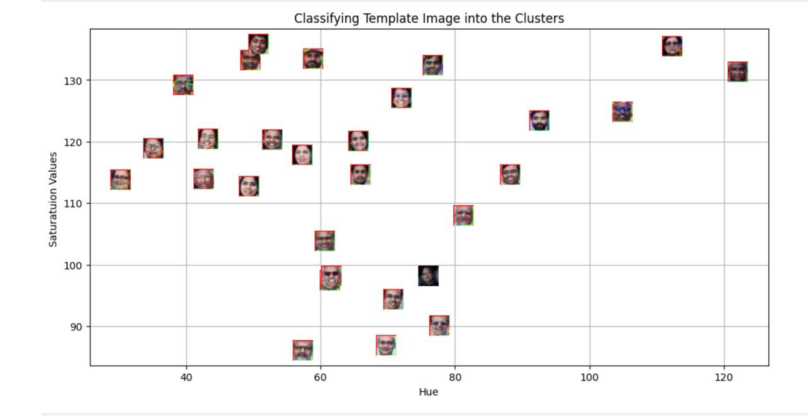
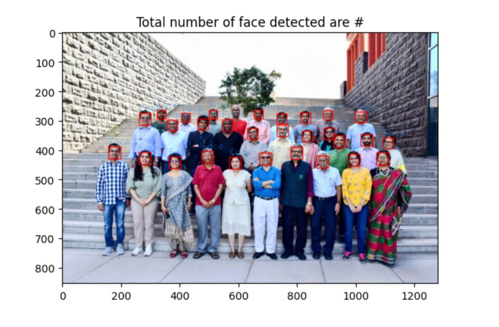
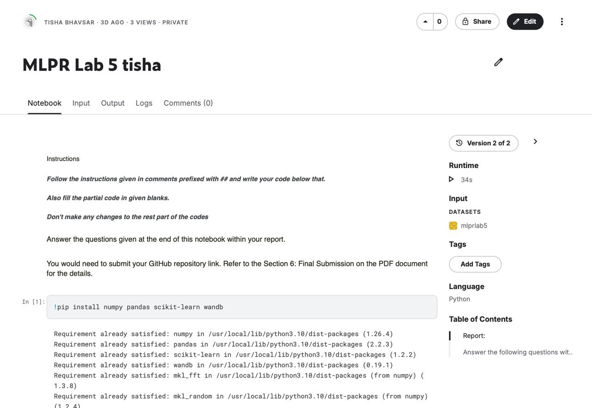
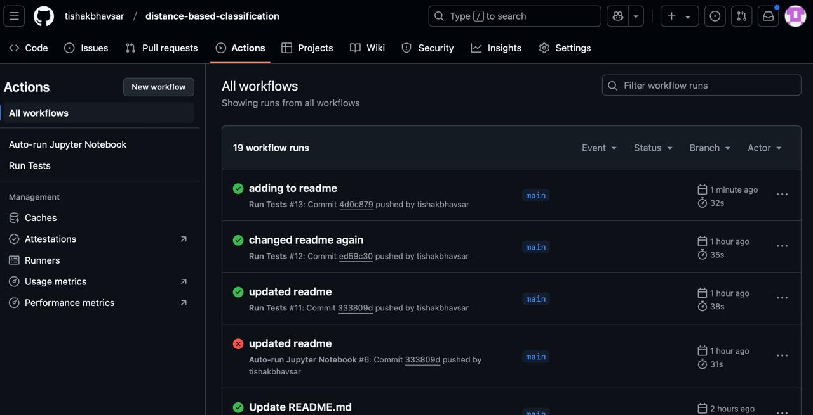

# Distance-Based Classification - MLPR Lab #

#### Screenshot of WandB Dashboard ####

### Assignment Images/Findings ### 

This project allowed me to explore a bunch of different tools I have never used before. I really liked the part where we used a kaggle notebook to log our plots into wandb dashboard. I initially faced some challenges using Docker due to some authentication bug on the application end, however this allowed me to learn more about how to use it and install it properly. Overall, this assignment helped us set up all the important spaces we need for our MLPR Project and I am glad to have managed to finally get this working. Below, I have attached some images supporting my assignment journey!

##### From the Jupyter Notebook File #####

##### Kaggle Processes #####

##### Github Actions Page #####

